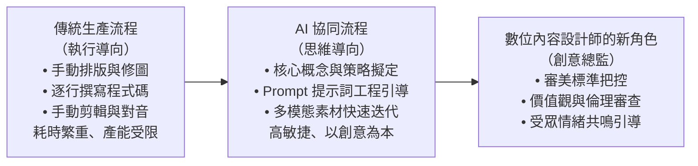
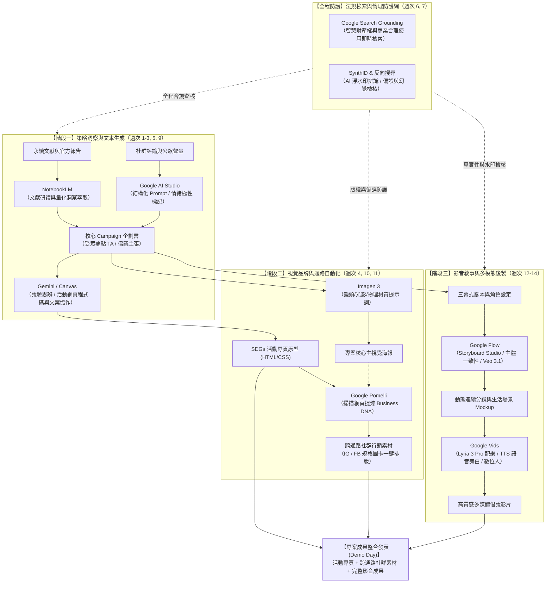
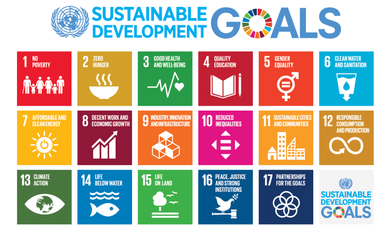
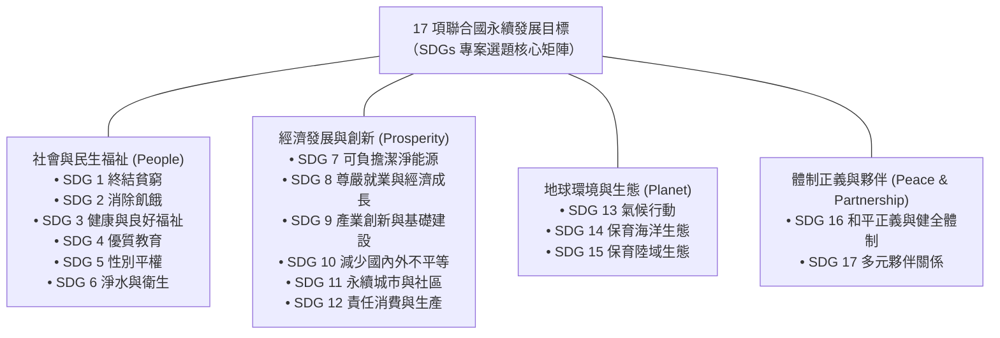
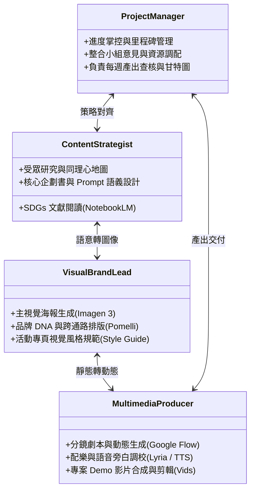
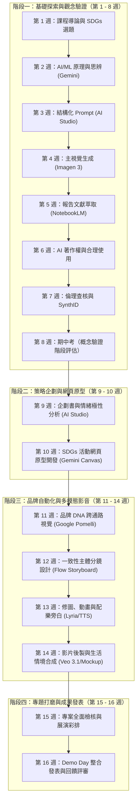

---
puppeteer:
  displayHeaderFooter: true
  headerTemplate: '
第一章：課程導論與 SDGs 數位內容專案啟航
'
  footerTemplate: '
第  頁 / 共  頁
'
  margin:
    top: "1.5cm"
    bottom: "1.5cm"
    left: "1.5cm"
    right: "1.5cm"
---

---

# 第一章：課程導論與 SDGs 數位內容專案啟航

## 課程導讀

歡迎來到「數位內容設計」的探索旅程。這門課程專門為大二學生設計，旨在帶領同學們跨越傳統數位傳播與新興科技的藩籬，走入由生成式人工智慧（Generative Artificial Intelligence，GenAI）所驅動的全新內容創作時代。在過去，製作一套完整的數位行銷專案往往需要龐大的專業團隊——文案寫手、視覺設計師、前端網頁工程師、分鏡師、影片剪輯師與配樂師，各司其職且製作週期動輒耗時數月。然而，隨著 Google AI 生態系的成熟，創作的門檻與流程正在經歷典範轉移。

本課程採用 **專案導向學習（Project-Based Learning，PBL）** 作為核心教學法。同學們將不再只是被動聆聽技術理論的旁觀者，而是以 3 至 5 人為一組，選定一項聯合國 **永續發展目標（Sustainable Development Goals，SDGs）** 作為專案主題，在接下來的 16 週內親身體驗從「議題洞察 ➔ 企劃擬定 ➔ 網頁原型開發 ➔ 跨通路視覺自動化 ➔ 影音多媒體製作 ➔ 成果發表」的完整數位行銷與內容生產鏈。

贯穿整門課程的中心指導原則如下：

> **AI 不是取代人類創意的替代品，而是將個人靈感指數級放大的「創意擴增器（Creative Amplifier）」。未來的優秀數位內容設計師，不再僅僅是技術工具的操作工，更是具備敏銳社會洞察、能夠駕馭 AI 團隊的「創意總監（Creative Director）」。**

每週課堂時間固定為 1 小時 50 分鐘，嚴格遵循高效的三段式學習架構：
1. **第一階段（25 分鐘）：** 核心理論講授與行銷觀念建立。
2. **第二階段（25 分鐘）：** Google AI 工具操作示範與即時調校。
3. **第三階段（60 分鐘）：** PBL 小組實作、課堂產出與教師即時回饋。

在本章中，我們將為大家建立 16 週的宏觀學習地圖，解析 Google AI 工具矩陣，觀摩指標性的永續影音案例，並完成小組團隊媒合與第一份專案方向設定單。

---

## 第一節：數位內容設計的典範轉移與 Google AI 工具生態系

### 1.1 什麼是數位內容設計？AI 時代的創意人新角色

數位內容（Digital Content）泛指所有以數位編碼形式存在、能透過網際網路或數位終端進行傳播、互動與消費的資訊媒介，包括文字報導、社群圖卡、互動網頁、短影音、播客配樂以及虛擬實境體驗等。

在傳統數位行銷與內容創作中，創作者往往深陷於技術細節的泥淖：為了排版一張宣傳海報，需要花費數小時調整圖層遮罩；為了剪輯一支 30 秒短片，必須反覆在音訊軌與視訊軌之間對齊節奏。技術操作的繁重負擔，經常擠壓了創作者思考核心策略與深刻故事的時間。

生成式 AI 的崛起並未抹殺人類的價值，而是將創作者從「手動執行者」解放為「創意決策者」。如下圖所示，內容創作者在現代數位生產流程中的定位發生了本質上的躍遷：

從圖中可以觀察到，未來的核心競爭力在於「問題定義能力」與「跨模態整合能力」。當生成一張高品質影像只需要數秒鐘時，決定專案成敗的關鍵便不再是繪圖技巧的高低，而是你是否能提出 **獨到的見解**、是否能**精準同理目標受眾（Target Audience，TA）的心理痛點**，以及是否具備 **足夠的審美感知**來篩選並打磨 AI 所生成的素材。

### 1.2 Google AI 工具生態系全貌矩陣

為了讓非資訊科技背景的大二同學也能順暢完成跨領域專案，本課程全面整合了 Google AI 工具生態系。這套工具矩陣覆蓋了數位行銷專案的完整生命週期，同學將在 16 週中循序漸進地學會調用各模組：

| 階段別 | 核心應用工具 | 核心功能與課堂實作任務 |
| :--- | :--- | :--- |
| **策略洞察與文本** | **Gemini**（對話模式 / Canvas） | 議題探索、蘇格拉底式思辨對話、活動網頁原型前端文案與 HTML 程式碼協作。 |
| | **Google AI Studio** | 模型參數調校（Temperature/Top-p）、結構化 Prompt 開發、社群情緒與極性文本標記。 |
| | **NotebookLM** | 導入聯合國與政府之永續官方報告與學術論文，基於來源文獻萃取質化與量化核心洞察。 |
| **視覺與品牌自動化** | **Imagen 3** | 根據鏡頭語言、光影構圖、材質物理等屬性提示詞，生成專案核心主視覺海報。 |
| | **Google Pomelli** | 掃描活動專頁自動提煉品牌基因（Business DNA），一鍵生成 IG/FB 跨通路規格行銷素材。 |
| **影音與多模態創意** | **Google Flow** | Storyboard Studio（主體一致性分鏡）、Inpainting 區域編修、靜態圖轉動畫、Veo 3.1 影音生成、Mockup 生活情境合成。 |
| | **Google Vids** | 結合企劃腳本、Lyria 3 Pro 無版權配樂生成、TTS 語音旁白、AI 數位人主播、雲端協作發表。 |
| **法規與倫理查核** | **Google Search Grounding** | 結合實時搜尋索引，檢索最新數位智慧財產權法規與商業合理使用（Fair Use）判例。 |
| **法規與倫理查核** | **SynthID / 反向搜尋** | 識別 AI 不可見浮水印，查核生成模型偏誤（Bias）、文化刻板印象與事實幻覺（Hallucination）。 |

這套矩陣並非孤立的工具堆疊，而是具有強大數據與邏輯流動的整合管線（Pipeline）。為了讓同學們建立清晰的全局工作流思維，下圖完整展示了從「資料洞察 ➔ 策略文本 ➔ 視覺品牌 ➔ 多模態影音」的端到端工具串接流程，以及貫穿全程的法規與倫理防護網：

從上方的整合管線圖中，可以清楚觀察到本課程的四大協同特點：
1. **上下游數據流動**：第 5 週在 NotebookLM 中萃取的研究洞察，直接注入第 9 週的企劃書；而第 10 週在 Gemini Canvas 中生成的活動網頁，成為第 11 週 Google Pomelli 自動提煉品牌色系與排版風格的輸入源。
2. **多模態資產沉澱**：從 Imagen 3 的平面海報、Pomelli 的社群圖卡，到 Flow 與 Vids 的動態影片，所有的視覺資產皆維持統一的品牌調性（Brand Consistency）。
3. **安全防護全程覆蓋**：Search Grounding 與 SynthID 橫跨所有階段，確保產出的內容兼具創新性、法律合規性與社會倫理責任。

### 1.3 課堂探索小活動：創作者的 AI 工具地圖初探

請同學們利用 3 分鐘時間，在課堂筆記或行動裝置上記錄以下問題：
1. 回顧過去一週，你曾經使用過哪些 AI 工具（如 ChatGPT、Gemini、Midjourney、Canva AI 等）？它們主要幫你解決了哪類問題（寫報告、修圖、查資料）？
2. 在上述 Google AI 工具矩陣中，哪一項工具（例如能生成音樂的 Lyria、保持人物一致性的 Storyboard Studio 或提煉品牌 DNA 的 Pomelli）最令你感到驚奇或期待？
3. 與身邊的同學交換彼此的筆記，觀察大家對於 AI 工具的期待與痛點有何不同。

> **老師的提醒：**
> * **切忌「為了用 AI 而用 AI」**：很多初學者在製作專案時，容易陷入新奇玩具的心態，在作品中塞滿炫目但毫無邏輯關聯的 AI 生成圖與特效。請記住， **內容的靈魂始終是想要傳達的核心訊息**。如果觀眾看完你的影片只記得「AI 效果很酷」，卻完全不知道你提倡的永續主張是什麼，這就是一次失敗的行銷設計。
> * **重視工具間的上下文銜接**：單一工具的產出只是素材，如何將文本、視覺、語音與代碼流暢串接，才是本學期要修練的硬實力。

---

## 第二節：SDGs 議題驅動的數位行銷與社會倡議

### 2.1 為什麼選擇聯合國永續發展目標（SDGs）？

聯合國於 2015 年通過了「2030 永續發展議程」，提出了 17 項永續發展目標（Sustainable Development Goals，SDGs），涵蓋了貧窮、飢餓、健康、教育、性別平權、水資源、氣候變遷、責任消費與生產等全球面臨的重大挑戰。在今日的商業社會中，企業社會責任（CSR）與環境、社會及公司治理（ESG）已不再是公關點綴，而是品牌存亡的關鍵指標。

本課程之所以選擇 SDGs 作為專題核心，原因有二：
1. **真實世界的問題複雜度：** SDGs 議題具有多面向的利害關係人與深層的社會痛點，最能考驗同學們進行受眾分析、資料萃取與說故事的能力。
2. **避免內容空洞化：** 許多學生專案常因選題缺乏深度，導致行銷企劃流於表面口號。以 SDGs 為根基，能讓同學們在真實文獻與數據中找到立論支撐。

為了協助各小組在發想專題時能有系統地盤點選題方向，下圖將聯合國 17 項永續發展目標完整歸納為四大維度（社會、經濟、生態、制度與夥伴）：

如上圖所示，17 項目標並非彼此割裂，而是高度互聯的整體系統。在第一週的小組腦力激盪中，同學可以從上述四大維度出發，自由選擇一項最能引發全組共鳴的目標作為專題的核心支點。

### 2.2 議題行銷（Cause Marketing）的核心心法：從道德說教到情感共鳴

在進行永續與社會議題的數位傳播時，初學者最常犯的錯誤是「居高臨下的道德說教（Moral Preaching）」。例如在宣傳海洋保育時，通篇使用「請大家不要再製造塑膠垃圾，否則地球會毀滅」等說教式標語。這類內容往往只會引發閱聽眾的心理抗拒與逃避，無法轉化為實際的行動。

成功的議題行銷（Cause Marketing）必須落實「同理心三階法則」：
- **感知（Feel）：** 不直接陳述龐大冰冷的數據，而是透過微觀的故事與鮮明的多模態視覺，讓受眾「感同身受」。
- **理解（Understand）：** 將複雜的因果關係視覺化，讓受眾看清問題與自己日常生活（如手搖杯、外送垃圾、二手衣浪費）的實質關聯。
- **行動（Act）：** 提供清晰、簡單且具備成就感的「行動呼籲（Call to Action，CTA）」，讓受眾覺得「只要我踏出一小步，就能產生改變」。

### 2.3 課堂案例觀摩：生活化 SDGs 情感敘事標竿與 Google AI 生態系對照

在課堂示範階段（第二階段 25 分鐘），我們將完整放映一部長度僅 3 分鐘但情感張力極高的 AI 短片作為 "故事敘事標竿"，並由授課教師進行最新 Google Vids 與 Google Flow 介面實機演示（Live Demo），帶領同學拆解 "同理心行銷" 如何與 "現代 AI 生態系" 深度融合：

#### 核心觀摩典範：AI 短片《全家福》—— 從生活微觀直擊社會痛點
- **示範影片**：[AI 短片《全家福》｜父母從來不是突然變老的，是我們缺席了他們慢慢變老的那些年](https://youtu.be/03chkZQ8m9M)
- **創作者**：Leah Joness ｜ **影片長度**：3 分 04 秒 ｜ **核心議題**：高齡社會心理健康、親情陪伴與孤獨感
- **對應永續目標**： **SDG 3（良好健康與福祉）** 與 **SDG 11（永續城市與高齡友善社會）**

#### 為什麼《全家福》是第一週最理想的 SDGs 企劃標竿？

1. **破除「永續很遙遠」的迷思（見微知著）**
   許多大二同學在初次接觸 SDGs 時，往往誤以為專案非得談論宏大的 "碳關稅、冰川融化、跨國饑荒"。《全家福》做出了最佳示範——**將宏觀的高齡化社會議題，聚焦在 "離家求學工作的大學生與逐漸老去的父母" 這一微觀日常痛點**。這種每個人都有切身體會的生活題材，最能引發全班與社群大眾的自發性共鳴。
2. **同理心三階法則的教科書級展現**
   - **感知（Feel）**：前 15 秒以泛黃舊照片的微動態（眨眼、呼吸感）開場，搭配溫柔的鋼琴與大提琴弦樂，瞬間消除心理防備。
   - **理解（Understand）**：影片不背誦人口統計數字，而是將抽象的時間流逝具象化為客廳家具的變遷、父母容貌與步態的逐漸蒼老，並以 " **父母從來不是突然變老的，是我們缺席了他們慢慢變老的那些年** " 這一金句直擊人心。
   - **行動（Act）**：全片沒有任何一句生硬的道德說教，但在片尾黑畫面留白時，卻讓觀眾產生極其強烈的行動渴望——"今晚就拿起手機打電話回家"。這就是最高境界的**隱性行動呼籲（Implicit Call to Action，CTA）**。

---

#### 專案對照：如何以 Google AI 工具鏈重現類似的高質感作品？

這部短片所呈現的視聽語言，精準對應了同學們在接下來 16 週將逐步掌握的 Google AI 核心技能：

| 影片核心技術環節 | 對應教學核心與解決痛點 | Google AI 工具生態系配置 | 對應課程進度 |
| :--- | :--- | :--- | :--- |
| **角色年齡跨度與面容一致** | 同一主角從青年、中年到老年的特徵穩定，解決分鏡 "換臉" 問題 | **Google Flow (Storyboard Studio)** | **第 12 週：腳本與分鏡設計** |
| **老照片活化與微運鏡** | 靜態圖轉動畫、鏡頭緩慢推進（Slow Push-in）與光影粒子營造 | **Google Flow (Veo 3.1 & 靜態轉動畫)** | **第 13–14 週：創意製作與後製** |
| **情感配樂與擬真旁白** | 原創溫情配樂生成（免版權疑慮）與富有情緒溫度的 TTS 語音朗讀 | **Google Vids (Lyria 3 Pro & TTS)** | **第 13 週：文字轉語音與配樂** |
| **活動專頁與社群傳播** | 宣傳短片整合至活動網頁，一鍵導出符合 IG/FB 的跨通路廣告規格 | **Gemini Canvas + Google Pomelli** | **第 10–11 週：網頁原型與品牌 DNA** |

---

### 2.4 課堂觀摩小活動：案例拆解與優劣分析

在觀看《全家福》（3 分 04 秒）後，請各小組在組內展開 5 分鐘快問快答討論，並指派一人記錄：
1. **情感共鳴點（Hook & Emotion）**：影片在哪一個瞬間最觸動你的情緒？該鏡頭使用了什麼樣的視覺元素（如眼神、白髮、空椅子）或聲音細節？
2. **受眾與痛點定義**：這支影片的 "目標受眾（TA）" 是誰？它所鎖定的 "核心社會痛點" 是什麼？
3. **行動呼籲分析**：如果由你們小組來為這支影片設計一個線上的 "社群互動行動呼籲（CTA）"，你們會規劃什麼樣的活動（例如：上傳一張跨越十年的對比照、發起週末陪伴打卡）？

> **老師的真心話：**
> * **切忌「題目選得太大」**：很多同學一開始就雄心壯志要解決 "全球暖化" 或 "消除世界貧窮"。請相信老師，題目越大，內容越空洞！**專案成功的秘訣是 "見微知著"**。就像《全家福》只講一家人的客廳，卻講透了高齡化社會的孤獨；你們的專案也可以只講 "政大校園外送飲料提袋減量計畫"，或者 "大二學生的熬夜抗焦慮指南"。鎖定身邊具體可驗證的痛點，你們才能做出打動人心的專案！
> * **杜絕「漂綠（Greenwashing）」與特效堆疊**：AI 工具再強大也只是工具，如果故事本身缺乏真誠的同理心與深層的田野洞察，再炫目的生成畫面也只是一堆空洞的像素。先感動自己，才能打動受眾！
> * **工具以最新官方介面為準**：在當前（2026 年）的 Google AI 工具環境中，Google Vids 與 Flow 均已全面原生支援中文介面與多模態提示詞。實作時請直接跟隨授課教師在課堂上的最新實機展示，無需使用過往過渡期的語系外掛技巧。

---

## 第三節：PBL 專案導向學習機制與 16 週里程碑全攻略

### 3.1 PBL 團隊作戰與專業角色分工

在當今數位行銷業界，沒有任何人能單打獨鬥完成一場完整的整合行銷戰役。本課程的 PBL 機制正是為了模擬真實職場跨職能團隊（Cross-functional Team）的協作模式。每組人數設定為 3 至 5 人，小組成員應在組內確立核心職責，既要各司其職，又要保持緊密協同：

- **專案經理（Project Manager，PM）：** 把控 16 週進度、維護小組專案文件夾、協調組內分工衝突，並確保每週實作產出按時交付。
- **內容策略與文案（Content Strategist）：** 主導 NotebookLM 洞察萃取，負責 Gemini 提示詞設計、活動網頁文案編寫與企劃書主筆。
- **視覺設計與品牌總監（Visual & Brand Lead）：** 專注於 Imagen 3 的鏡頭與材質語彙調校，運用 Pomelli 提煉品牌色彩與字型規範，把控專案所有視覺輸出的美學一致性。
- **多模態影音製作（Multimedia Producer）：** 專精於 Google Flow 的分鏡控制與 Veo 3.1 生成，掌管 Google Vids 剪輯合成、Lyria 配樂與旁白節奏。

### 3.2 16 週專案進程四大里程碑地圖

為了讓全體同學對整學期的學習進程具備清晰的預期，我們將 16 週課程劃分為四個環環相扣的戰略階段：

- **階段一：基礎探索與觀念驗證（第 1–8 週）**：從 AI 基本觀念起步，學習結構化提示工程，掌握 Imagen 3 與 NotebookLM，並在期中考前深入探討法規與倫理，建立堅實的技術底氣。
- **階段二：策略企劃與網頁原型（第 9–10 週）**：正式啟動專題企劃！透過真實社群數據的情緒分析找準痛點，並藉由 Gemini Canvas 直接協同編寫出活動專題網頁的完整 HTML/CSS 原型。
- **階段三：品牌自動化與多模態影音（第 11–14 週）**：迎來專案產能爆發期！利用 Pomelli 實現一鍵跨通路社群素材排版，並透過 Google Flow 與 Vids 完成極具震撼力的影音故事與生活情境 Mockup。
- **階段四：專題打磨與成果發表（第 15–16 週）**：拒絕期末草率收尾！第 15 週預留為一對一作品拋光診斷，第 16 週盛大舉辦 Demo Day，接受跨界評審與同儕的公開檢驗。

### 3.3 課堂團隊小活動：小組破冰與成員互選

現在請全班起立進行組隊交流（10 分鐘）：
1. 自由尋找 3 至 5 位志同道合的夥伴組成小組。建議組內兼具不同專長（例如擅長文案構思、具備美感美編、對影音節奏敏銳、具備邏輯組織力）。
2. 在組內推選出第一位「專案經理（PM）」，由 PM 在課堂白板或線上共編表單登記小組成員學號與名單。
3. 彼此分享一項自己最希望在大學期間發揮影響力改變的社會現象。

> **老師的提醒：**
> * **重視心理安全感與透明溝通**：PBL 專案最怕的是成員有意見不敢提，最後演變成冷漠與「搭便車（Free-rider）」。每組應建立共用協作雲端（Google Drive / Notion），所有 Prompt 紀錄與素材產出皆須透明共享。
> * **角色是輪動與互助的**：分工是為了讓責任清楚，而不是各行其是。PM 也要懂提示詞，文案也要協助挑選配樂，跨領域碰撞才會激盪出最棒的創意。

---

## 第四節：PBL 課堂工作坊——確立 SDGs 專案方向

### 4.1 議題探索三步驟：如何選出有感的題目？

進入課堂最後 1 小時的重頭戲——小組實作。請各組依照下列三步驟迅速收斂專題題目：

1. **第一步：初篩與共感（Broad Scanning）**
   瀏覽 17 項 SDGs 清單，每位組員挑選出 1 項自己最有熱情的目標，組內投票選出重疊度最高或最引起全組共鳴的 1 項主目標。
2. **第二步：場景在地化與具象化（Localization & Grounding）**
   切忌直接套用國際聯合國報告的宏大敘事。請將選定的目標「落地」到你我生活的具體場景：
   - *場景範例 A：* 不是泛談 SDG 13（氣候行動），而是探討「大學生外送餐點所產生的單次性塑膠餐具與碳足跡」。
   - *場景範例 B：* 不是泛談 SDG 3（健康福祉），而是鎖定「都會青年在社群媒體演算法下的容貌焦慮與孤獨感」。
   - *場景範例 C：* 不是泛談 SDG 11（永續城市），而是規劃「老舊街區傳統工藝職人的數位轉型與地方記憶保存」。
3. **第三步：確立初步受眾與核心主張（Core Message & TA）**
   明確回答：「這個數位行銷專案，究竟是做給誰看的？我們希望他看完了之後，思想或行為產生什麼具體改變？」

### 4.2 專案設定示範案例（Reference Benchmark）

為了幫助同學們掌握規格，以下提供一份優質的專案方向設定範例供各組參照：

> #### 範例：《格外美好》—— 大學生活圈醜蔬果剩食搶救倡議專案
> * **對應目標：** **SDG 12：責任消費與生產**（特別針對 Target 12.3：全球人均糧食浪費減半）。
> * **目標受眾（TA）：** 經常自行開伙或喜愛夜市美食的大學外宿學生（18–24 歲）。
> * **核心社會痛點：** 大量外觀不對稱、有斑點但營養完全無虞的「格外品蔬果」，在產地與超市前端直接遭到淘汰拋棄，造成每年數十萬噸食物浪費；同時大學外宿族卻經常因物價高漲而面臨蔬果攝取不足的營養困境。
> * **專案倡議主張：** 「外表不完美，風味更甜美！用格外品打造平價五星級深夜料理，吃進健康、省下荷包、拯救地球。」
> * **預期全案數位產出：**
>   - 透過 NotebookLM 萃取台灣格外品損耗數據建立公信力。
>   - 用 Imagen 3 設計帶有幽默擬人化特質的「醜果復仇者聯盟」核心主視覺海報。
>   - 用 Gemini Canvas 開發「校園周邊格外品地圖與快閃搶救食譜」活動專頁原型。
>   - 用 Google Pomelli 一鍵導出 IG 食譜圖卡與限時動態視覺素材。
>   - 用 Google Flow 與 Vids 製作「醜果大翻身——30秒快手料理短影音」，搭配 Lyria 原創輕快節奏配樂。

### 4.3 課堂實作任務：《SDGs 專案方向初步設定單》

請各組利用接下來的課堂實作時間（40 分鐘），在組內展開深度討論，完成並繳交下表：

| 欄位項目 | 規劃內容填寫區（小組共編） |
| :--- | :--- |
| **小組組名** | （例：格外正義聯盟 / 綠光行動小組） |
| **小組成員與分工** | PM： 內容策略： 視覺總監： 多模態影音： |
| **選定之 SDGs 目標** | 第 ______ 號目標：________________________（中文名稱） |
| **專案暫定名稱** | 《________________________________________》 |
| **目標受眾（TA）畫像** | 年齡、生活場景、心理痛點特徵描述（約 50–100 字）： |
| **核心倡議主張（一句話）** | （例：只要改變一個消費習慣，就能拯救一片珊瑚礁） |
| **初步構想與數位內容形式** | 預計規劃的行銷活動概念與亮點（約 100–150 字）： |

在各組討論期間，授課教師與助教將逐組巡視各桌，針對各組的選題可行性、痛點聚焦度與後續多模態工具的發揮空間，提供一對一的即時診斷與方向修正（20 分鐘）。

> **老師的真心話：**
> * **不要害怕被老師打槍修正！** 第一週的方向調整是專案最便宜的成本。如果現在方向含糊不清，到了第 10 週寫網頁、第 14 週做影片時，全組就會面臨砍掉重練的災難。
> * **選題要選組員自己「真心有感覺」的題目**。如果全組對流浪動物議題特別有熱情，那就選 SDG 15；如果大家對性別薪資或職場玻璃天花板有共鳴，那就選 SDG 5。只有創作者自己先被感動，產出的內容才能打動觀眾！

---

## 本章小結與課後任務

### 核心觀念回顧

1. **創作範式的升級：** 生成式 AI 正在重塑數位內容設計產業，創作者由繁瑣的技術苦工轉變為擁有全局視野的「創意總監」，透過提示工程協同指揮 AI 工具矩陣。
2. **Google AI 工具鏈價值：** 本課程打造了貫穿「文本洞察（Gemini/NotebookLM）➔ 視覺品牌（Imagen 3/Pomelli）➔ 影音多模態（Flow/Vids）➔ 倫理把關（Grounding/SynthID）」的無縫生產鏈。
3. **SDGs 議題行銷之鑰：** 杜絕空泛說教與漂綠包裝，聚焦身邊微觀痛點，以同理心出發，驅動閱聽眾從「感知」、「理解」走向實質「行動」。
4. **PBL 團隊協作承諾：** 確立 PM、文案、視覺與影音的專業分工，以敏捷反覆迭代的精神，迎接 16 週的專案長征。

---

### 本週產出與課後檢核清單（Checklist）

請各組 PM 與組員在下課前務必完成以下事項確認：

- [ ] **完成小組組隊：** 每組 3 至 5 人，並確認所有組員均已加入課程通訊群組。
- [ ] **完成分工登記：** 明確指定 PM、內容策略、視覺總監與多模態影音的負責人。
- [ ] **繳交專案設定單：** 課堂結束前將《SDGs 專案方向初步設定單》繳交至課程雲端平台，並確認已獲得教師初步審核許可。
- [ ] **環境準備與帳號確認：** 確認每位組員均能以個人 Google 帳號正常登入 Google 雲端硬碟、Gemini、Google AI Studio 等服務，為後續實機操作做好準備。

---

### 下週預告

在下一週（第 2 週，9/23）的課程中，我們將正式揭開科技底層的面紗—— **【AI 的基本概念：什麼是人工智慧？】 **。
我們將使用 **Gemini** 展開一場深度的「蘇格拉底式提問對話」，親手拆解傳統程式邏輯與機器學習的本質差異，理解模型如何從資料中學習規律，並為第 3 週的結構化提示工程（Prompt Engineering）打下扎實的思維根基。請同學們帶著探索的好奇心，準時出席！
