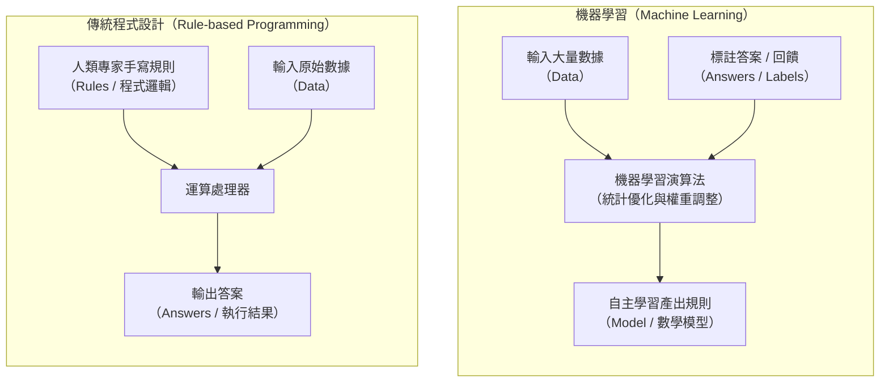
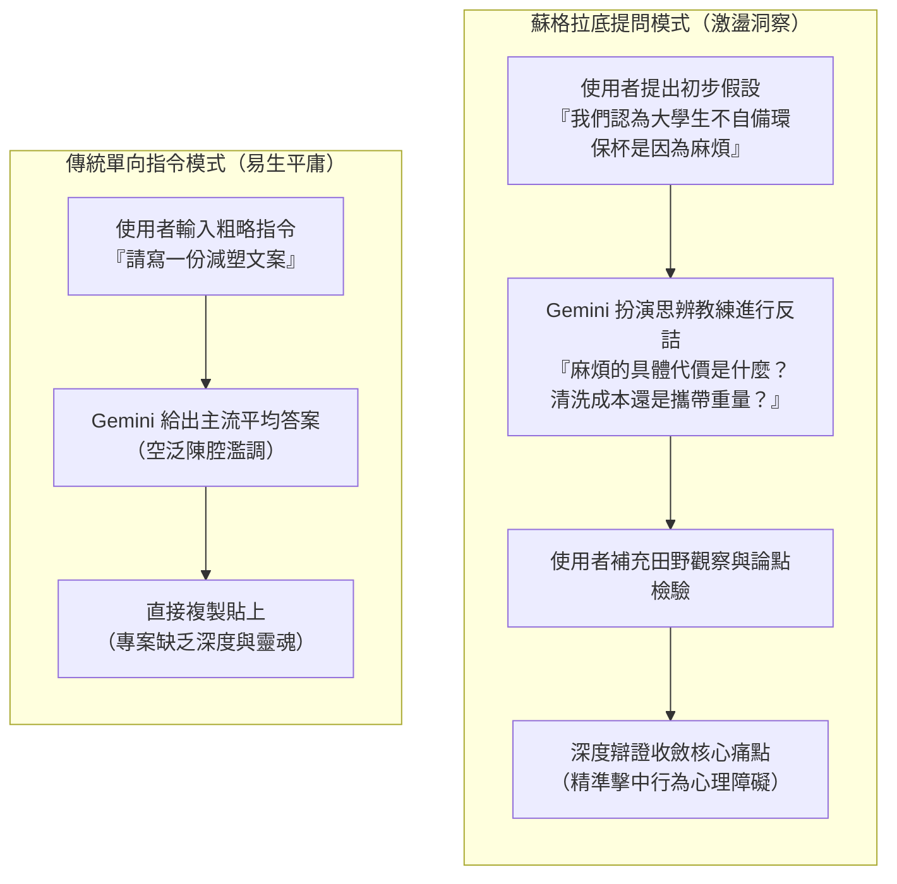
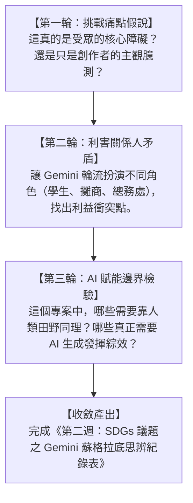

---
puppeteer:
  displayHeaderFooter: true
  headerTemplate: '<div style="font-size: 10px; margin: 0 auto;">第二章：人工智慧本質探究與機器學習思辨</div>'
  footerTemplate: '<div style="font-size: 10px; margin: 0 auto;">第 <span class="pageNumber"></span> 頁 / 共 <span class="totalPages"></span> 頁</div>'
  margin:
    top: "1.5cm"
    bottom: "1.5cm"
    left: "1.5cm"
    right: "1.5cm"
---
<style>
  /* 全域字型、字級與行距 */
  body {
    font-size: 16pt !important;
    line-height: 1.7 !important;
    font-family: "Microsoft JhengHei", "PingFang TC", "Helvetica Neue", sans-serif;
  }

  /* 階層標題微調 */
  h1 { font-size: 28pt !important; margin-bottom: 0.5em !important; }
  h2 { font-size: 22pt !important; page-break-before: always; }
  h3 { font-size: 18pt !important; }
  h4 { font-size: 15pt !important; }

  /* 表格文字與排版優化 (防 PDF 溢出) */
  table {
    width: 100% !important;
    max-width: 100% !important;
    table-layout: fixed !important;
    border-collapse: collapse !important;
    box-sizing: border-box !important;
    margin: 1.2em 0 !important;
    page-break-inside: auto !important;
  }

  thead {
    display: table-header-group !important;
  }

  tr {
    page-break-inside: avoid !important;
  }

  th, td {
    font-size: 11pt !important;
    line-height: 1.45 !important;
    padding: 6px 8px !important;
    border: 1px solid #d0d7de !important;
    vertical-align: top !important;
    word-wrap: break-word !important;
    word-break: break-word !important;
    overflow-wrap: anywhere !important;
    white-space: normal !important;
  }

  th {
    background-color: #f6f8fa !important;
    font-weight: bold !important;
    text-align: left !important;
  }

  /* 智慧欄寬配比 */
  /* 2 欄表格 (例如：實作設定單) */
  table tr > th:first-child:nth-last-child(2),
  table tr > td:first-child:nth-last-child(2) {
    width: 28% !important;
  }
  table tr > th:nth-child(2):nth-last-child(1),
  table tr > td:nth-child(2):nth-last-child(1) {
    width: 72% !important;
  }

  /* 3 欄表格 (例如：六大提問維度) */
  table tr > th:first-child:nth-last-child(3),
  table tr > td:first-child:nth-last-child(3) {
    width: 22% !important;
  }
  table tr > th:nth-child(2):nth-last-child(2),
  table tr > td:nth-child(2):nth-last-child(2) {
    width: 28% !important;
  }
  table tr > th:nth-child(3):nth-last-child(1),
  table tr > td:nth-child(3):nth-last-child(1) {
    width: 50% !important;
  }

  /* 4 欄表格 (例如：AI/ML/DL/GenAI 技術層級) */
  table tr > th:first-child:nth-last-child(4),
  table tr > td:first-child:nth-last-child(4) {
    width: 18% !important;
  }
  table tr > th:nth-child(2):nth-last-child(3),
  table tr > td:nth-child(2):nth-last-child(3) {
    width: 22% !important;
  }
  table tr > th:nth-child(3):nth-last-child(2),
  table tr > td:nth-child(3):nth-last-child(2) {
    width: 32% !important;
  }
  table tr > th:nth-child(4):nth-last-child(1),
  table tr > td:nth-child(4):nth-last-child(1) {
    width: 28% !important;
  }

  /* 程式碼與提示詞區塊 (防 PDF 溢出) */
  pre {
    font-size: 11pt !important;
    line-height: 1.5 !important;
    font-family: Consolas, "Courier New", monospace !important;
    white-space: pre-wrap !important;
    word-wrap: break-word !important;
    word-break: break-word !important;
    overflow-wrap: anywhere !important;
    max-width: 100% !important;
    box-sizing: border-box !important;
    margin: 1em 0 !important;
    padding: 10px 14px !important;
    background-color: #f6f8fa !important;
    border: 1px solid #d0d7de !important;
    border-radius: 6px !important;
    page-break-inside: avoid !important;
  }

  pre code {
    font-size: 11pt !important;
    line-height: 1.5 !important;
    font-family: Consolas, "Courier New", monospace !important;
    white-space: pre-wrap !important;
    word-break: break-word !important;
    overflow-wrap: anywhere !important;
  }

  code:not(pre code) {
    font-size: 0.9em !important;
    font-family: Consolas, "Courier New", monospace !important;
    background-color: rgba(175, 184, 193, 0.2) !important;
    padding: 0.2em 0.4em !important;
    border-radius: 4px !important;
  }

  /* Mermaid 流程圖節點字體放大 */
  .mermaid text {
    font-size: 16px !important;
  }
</style>
---

# 第二章：人工智慧本質探究與機器學習思辨

## 課程導讀

在第一週的課程中，我們建立了貫穿 16 週的專案導向學習（PBL）藍圖，並確立了以聯合國永續發展目標（SDGs）為核心的專案方向。當代數位內容設計師所面臨的第一個核心挑戰，往往不是工具操作不熟練，而是對「人工智慧究竟是什麼」抱持著過度浪漫的科幻幻想，或是將其簡化為「功能強大的自動化軟體」。

本章作為科技底層原理的扎根之章，旨在帶領非資訊科技背景的大二同學，撥開商業宣傳的迷霧，從計算機科學與統計學習的真實視角，重新審視人工智慧的學術本質。我們將深入探討從早期「手寫規則系統」跨越到現代「數據驅動機器學習」的思維典範轉移，並透過 Google 的旗艦模型 **Gemini** 展開一場深度的「蘇格拉底式提問對話（Socratic Dialogue）」，藉由人機辯證的過程，對各組選定的 SDGs 核心痛點進行嚴格的邏輯壓力測試。

貫穿本週學習的核心心法如下：

> **傳統程式設計是「人類將思考好的規則告訴電腦」，而現代機器學習則是「電腦透過大量數據自行歸納出規律」。未來的數位內容創意人，不應只是被動接受 AI 答案的受詞，而是要善用批判性思維，成為駕馭 AI 進行多維度思辨的主詞。**

本週課堂嚴格遵循 1 小時 50 分鐘的標準三段式結構：
1. **第一階段（25 分鐘）：** 人工智慧核心理論講授與機器學習思維建立。
2. **第二階段（25 分鐘）：** Gemini 蘇格拉底式思辨提問示範與提示詞調校。
3. **第三階段（60 分鐘）：** PBL 小組實作——SDGs 議題之人機深度思辨工作坊與回饋。

---

## 第一節：什麼是人工智慧？從規則系統到機器學習的範式轉移

### 1.1 人工智慧的學術定義與圖靈測試

在日常生活中，「人工智慧（Artificial Intelligence，AI）」這個詞彙經常出現在新聞標題與科幻電影中，從無所不能的超級電腦到具備自我意識的仿生機器人。然而，在計算機科學的學術領域中，人工智慧並非賦予機器「靈魂」或「自主意識」，而是一門探討如何建構計算系統，使其展現出過去必須依賴「人類智能」才能完成的任務（例如語言理解、視覺辨識、歸納推理與策略決策）的工程學科。

計算機科學之父艾倫·圖靈（Alan Turing）在 1950 年發表了劃時代的論文《計算機器與智能》（Computing Machinery and Intelligence），並提出了著名的「圖靈測試（Turing Test）」。圖靈主張，我們不應陷入「機器是否能夠思考」這一無法客觀度量的哲學泥淖，而應採取行為主義的實證視角：如果一台機器在透過文字通訊與人類評審員進行盲測對話時，其回答表現足以讓人類評審員無法分辨對方究竟是人類還是機器，那麼我們就應當承認該系統展現出了智能行為。

現代計算機科學家通常將人工智慧劃分為兩大發展維度：
1. **狹義人工智慧（Artificial Narrow Intelligence，ANI）：** 又稱為弱人工智慧（Weak AI）。這類系統只能在特定的受限領域內執行單一或少數特定任務，例如西洋棋程式、手機人臉辨識、垃圾郵件過濾器或是音樂推薦系統。即使是當前能力驚人的大型語言模型，在本質上依然屬於狹義 AI 的範疇，因為它們並不具備真正的自我生存動機或跨領域的通用自主意識。
2. **通用人工智慧（Artificial General Intelligence，AGI）：** 又稱為強人工智慧（Strong AI）。指具備如同人類一般全面的認知、推理、自我反思與跨領域學習遷移能力的假想系統。截至目前為止，人類科技尚未實現真正的 AGI。

### 1.2 傳統程式設計 vs. 機器學習：思維的根本翻轉

要真正理解現代 AI 為什麼能在文本與圖像創作領域帶來爆發式變革，就必須理解計算機解決問題方式的「根本思維翻轉」。

在傳統的軟體工程中，電腦扮演的是極其忠實但缺乏主動性的「執行者」。人類工程師必須事先窮盡問題的所有可能邏輯，將業務規則以一連串精確的條件判斷式（例如 `If-Else`）逐行編寫進程式碼中。這種方法被稱為「**規則導向系統（Rule-based Systems）**」。

然而，當面對真實世界高度複雜的自然現象時（例如：辨識一隻貓的圖片、理解一段諷刺的社群評論、判斷一句廣告文案是否具備感染力），人類專家根本無法透過手工編寫的規則來窮盡所有的特徵與例外情況。這時， **機器學習（Machine Learning，ML）** 應運而生。

如下圖所示，傳統程式設計與機器學習在資料流動與邏輯產出上，呈現出完全相反的範式：



從圖中可以觀察到：
- **傳統程式設計**：輸入是「規則」加「數據」，輸出是「答案」。如果工程師沒有預先寫下規則，電腦就完全無法處理未見過的狀況。
- **機器學習**：輸入是「數據」加「答案（或環境反饋）」，輸出則是「模型（亦即自數據中歸納出來的數學規律）」。一旦模型訓練完成，就能將新的未見資料輸入模型，自主進行預測或生成。

為了讓大家更有體會，我們以「垃圾郵件過濾」為例：
- **傳統規則做法**：工程師在後台手寫關鍵字清單——「只要信件包含『發財、中獎、免費領取』，就判定為垃圾郵件」。這種做法極其脆弱，寄信者只要故意寫成「中.獎」或「免-費」，規則便立刻失效。
- **機器學習做法**：演算法收集了 10 萬封正常信件與 10 萬封垃圾信件，自動統計字詞在不同信件中出現的條件機率分布。模型不僅能學會多個單字的綜合關聯，還能根據使用者隨後的檢舉行為持續動態調整權重，展現出高度的適應力與泛化能力。

### 1.3 AI、ML、DL 與 GenAI 的層級全貌

在媒體報導中，人工智慧、機器學習、深度學習與生成式 AI 經常被混為一談。實際上，它們彼此之間存在著嚴謹的包含關係，如同俄羅斯套娃一般層層嵌套：

| 技術層級 | 中英文全稱與簡稱 | 核心本質與特徵機制 | 內容設計領域典型應用場景 |
| :--- | :--- | :--- | :--- |
| **第一層（最外層）** | **人工智慧（Artificial Intelligence，AI）** | 涵蓋所有讓計算機展現人類智能行為的廣義領域，包含手動規則、專家系統與統計模型。 | 自動化對齊工具、網頁響應式排版邏輯。 |
| **第二層** | **機器學習（Machine Learning，ML）** | AI 的核心子領域，強調系統不依賴硬編碼規則，而是從歷史數據中自主學習統計規律。 | 社群受眾輪廓分群、廣告點擊率預測模型。 |
| **第三層** | **深度學習（Deep Learning，DL）** | ML 的進階分支，模仿生物神經網路結構，利用深層神經網路（Neural Networks）自主提取多維特徵。 | 照片超解析度放大、語音即時轉文字（ASR）。 |
| **第四層（最內層）** | **生成式 AI（Generative AI，GenAI）** | 基於現代深度學習架構（如 Transformer 與擴散模型），具備理解語境並創造全新多模態內容的能力。 | Gemini 企劃文案協作、Imagen 3 海報繪製、Veo 影音合成。 |

在傳統機器學習時代，系統高度依賴人類資料科學家的「特徵工程（Feature Engineering）」——工程師必須告訴電腦「請計算圖像的邊緣曲率」或「請統計名詞的出現頻率」。然而， **深度學習（Deep Learning）** 徹底突破了這道瓶頸，它能夠在多層神經網路中，自動從最底層的原始訊號（像素或字符）逐步抽象出高階概念（物體形狀、光影氛圍或情感語氣）。

正因為深度學習具備了這種強大的多維度語意表徵能力，當代的大型語言模型（如 Gemini）與擴散影像模型（如 Imagen 3）才能跨越傳統判別任務的局限，進入「無中生有、跨模態合成」的生成式 AI 時代。

### 1.4 課堂探索小活動：生活中的「假 AI」與「真 AI」快篩辨識

請同學們花費 3 分鐘，檢視以下生活常見的科技功能，並與鄰座同學討論它們屬於「傳統條件規則自動化（Rule-based）」還是「機器學習 / 深度學習（ML/DL）」：
1. **冷氣機的舒眠定溫模式**：當室溫高於 26 度時啟動壓縮機，低於 24 度時降頻運轉。
2. **手機相機的人像虛化功能**：拍攝時即時識別人臉、頭髮絲與背景邊界，並將背景自然模糊化。
3. **社群平台的短影音推薦串流**：根據你的停留秒數、滑過速度、點讚互動與歷史觀看紀錄，動態推送你下一支可能感興趣的影片。
4. **自動販賣機的退幣計算**：投入 50 元購買 35 元飲料，自動計算並吐出 1 個 10 元與 1 個 5 元硬幣。

> **老師的提醒：**
> * **切勿將「條件判斷式（If-Else）」誤認為「人工智慧」**：市面上許多家電或行銷軟體標榜「智慧節能」或「AI 智能提醒」，拆開其底層邏輯，其實只是一段寫死固定數值的條件式。 **真正的 AI/ML 系統必須具備基於資料的統計模型，其決策權重是透過數據學習調整而來的，具備處理未知特例的泛化能力**。
> * **生成不是理解的唯一證明**：當 Gemini 生成了一篇辭藻華麗的永續倡議企劃書時，模型本質上是在高維向量空間中計算下一個最可能的 Token 機率分布，而非像人類一樣「感受到了地球的痛苦」。因此，創作者必須承擔「價值判斷」與「事實查核」的最後防線。

---

## 第二節：Gemini 蘇格拉底式提問對話實戰

### 2.1 為什麼在創意專案中需要「蘇格拉底式提問」？

在過去使用生成式 AI 的習慣中，絕大多數初學者常將模型當成「高效的搜尋引擎」或「廉價的寫手」。常見的使用場景往往是直接給出一個平庸的指令（例如：「請幫我寫一份關於減塑的宣傳文案」），然後毫無保留地複製貼上模型給出的第一組答案。

這種「單向索取答案」的操作方式，存在著三大致命缺陷：
1. **思維偷懶與同質化（Cognitive Laziness）**：大語言模型預設會給出機率最高、最主流也最平庸的答案。如果創作者不對其提問，產出的內容必然充斥著老生常談的陳腔濫調。
2. **缺乏批判性檢驗（Illusion of Validity）**：模型在面對模糊問題時容易產生討好使用者的幻覺，給出看似條理清晰卻經不起推敲的論點。
3. **專案失去靈魂**：創作者失去了在問題中掙扎、思辨與收斂的過程，專案最終淪為沒有觀點的拼貼品。

古希臘哲學家蘇格拉底（Socrates）在教學時從不直接給予學生答案，而是透過連續的反詰提問（Probing Questions），引導學生檢驗自己的未經審視的前提，進而在邏輯矛盾中發現真實的洞察。在數位內容設計中， **我們可以將 Gemini 角色反轉，設定為一位尖銳的「蘇格拉底式思辨教練」**，讓 AI 反過來詰問我們，藉此逼出更具深度的行銷創意與論點支撐。



### 2.2 蘇格拉底提問法（Socratic Dialogue）的六大提問維度模板

在與 Gemini 進行思辨對話時，我們可以引導系統調用教育哲學家理查德·保羅（Richard Paul）所歸納的「蘇格拉底六大提問維度」，逐層剝開問題的核心：

| 提問維度 | 核心思考方向 | 引導 Gemini 對專案提問的示範 Prompt 語句 |
| :--- | :--- | :--- |
| **1. 澄清問題（Clarification）** | 釐清名詞定義與核心概念，避免各說各話。 | *「請檢視我提出的倡議主張，指出哪幾個詞彙定義最為模糊？你會如何要求我進一步界定？」* |
| **2. 探究前提假設（Probing Assumptions）** | 找出想法背後被視為理所當然、卻未經證實的假設。 | *「我們認為大學生會在意外送垃圾，這個想法背後隱含了哪些未經證實的前提？請挑戰它。」* |
| **3. 檢驗證據理由（Probing Reasons & Evidence）** | 檢驗論點是否有具體事實、文獻或數據支持。 | *「如果我是反對這個政策的質疑者，我會要求你拿出哪些客觀數據來證明這個問題的嚴重性？」* |
| **4. 探索多元視角（Questioning Perspectives）** | 換位思考，探索不同利害關係人的矛盾與衝突。 | *「請分別扮演『外宿學生』、『校園周邊餐飲店家』與『學校總務處』，指出你們彼此利益衝突的焦點何在？」* |
| **5. 探討後果影響（Probing Consequences）** | 預測行動可能引發的連鎖反應或非預期後果（Side Effects）。 | *「如果我們發起的宣傳活動成功讓所有人都自備容器，可能會衍生出哪些新的問題或成本負擔？」* |
| **6. 對提問本身反思（Questions About the Question）** | 跳出框架，重新審視這個題目是否問錯了方向。 | *「我們一直在討論如何提高回收率，這個問題本身是否存在盲點？有沒有比回收更根本的解決路徑？」* |

### 2.3 課堂實機示範：用 Gemini 辯證一個生活直覺——「紙袋真的比塑膠袋環保嗎？」

在課堂示範階段，授課教師將在投影幕上展示如何使用 Gemini 進行生活迷思的深度思辨：

#### 示範步驟一：建立蘇格拉底教練角色設定（System Prompt）

```text
你現在是一位具備嚴謹批判性思維的「蘇格拉底式環境永續研究員」。
在接下來的對話中，請嚴格遵守以下規則：
1. 不要直接給我現成的結論或標準答案。
2. 針對我提出的每一個觀點，找出其邏輯漏洞或未經檢驗的前提，
   並向我提出 1 到 2 個尖銳的追問。
3. 引導我從「全生命週期評估（LCA）」、「製造能耗」、
   「運輸碳足跡」與「實際回收率」等客觀維度深入思考。
準備好後，請簡短問我：我想要探討哪一個永續倡議假說？
```

#### 示範步驟二：人機思辨對話節錄
- **學生初步觀點**：*「我們小組認為，校園周邊商家應該全面以紙袋取代塑膠袋，因為紙張可以自然分解，所以紙袋一定比塑膠袋更環保。」*
- **Gemini 的蘇格拉底反詰**：
  > *「這聽起來非常符合直覺。但讓我們先來審視『紙張可以自然分解』這個前提：*
  > *1. 製造一個標準牛皮紙袋所消耗的水資源、伐木砍樹的碳吸收損失，以及化學製漿過程產生的廢水污染，與提煉石油製造一個輕量塑膠袋相比，哪一個在前期的環境成本更高？*
  > *2. 如果這個紙袋為了防油防水而塗上了一層薄薄的聚乙烯（PE）塑膠淋膜，它在一般掩埋場中還能如你所想的快速自然分解嗎？如果不能，你的倡議是否只是換了一種形式的塑膠垃圾？」*

透過這兩道反詰，學生立刻意識到原本單純的「紙 vs. 塑膠」善惡二元對立，背後隱藏著複雜的材料工程與全生命週期（Life Cycle Assessment，LCA）科學問題。專案的切入點也從原本粗淺的「全面換紙袋」，深化為「如何推動真正可重複循環使用的容器借還機制」。

### 2.4 課堂操作小練習：3 分鐘角色反轉提問體驗

請同學們打開筆電或平板，連線至 Gemini（[gemini.google.com](https://gemini.google.com)），進行 3 分鐘快速實作：
1. 輸入以下提示詞，啟動思辨教練：
   > `請扮演我的專案思辨教練。我目前正在規劃一個大專院校的永續行銷專案，`
   > `我認為【請填入一項你目前的主觀想法，例如：大學生之所以不自備環保杯`
   > `是因為忘記帶】。請用蘇格拉底的方式，提出兩個最刁鑽的問題挑戰我的觀點。`
2. 閱讀 Gemini 拋出的兩個反詰問題，體會思維被挑戰的感覺。
3. 與組員分享：「哪一個問題讓你覺得最難以回答？」

> **老師的真心話：**
> * **擁抱被反駁的痛苦**：在人機協作時代，最廉價的是讚美，最珍貴的是建設性的批判。很多同學喜歡在 AI 給出稱讚時沾沾自喜，但如果你給出的方案 AI 一律回答「太棒了、很有創意」，往往代表你的 Prompt 太過封閉，或者 AI 在進行低水準的迎合。
> * **好問題比好答案重要十倍**：一個平庸的題目，就算用最高階的 Imagen 3 與 Veo 3.1 渲染，依然是一支無趣的影片；唯有經過蘇格拉底式提問淬鍊出的深刻痛點，才能支撐起打動人心的偉大企劃。

---

## 第三節：PBL 課堂工作坊——SDGs 議題的人機深度思辨

### 3.1 議題批判性檢驗工作流（Critical Reflection Workflow）

進入本週最後 1 小時的小組工作坊時間。請各組以第一週填寫的《SDGs 專案方向初步設定單》為起點，將選定的議題帶入 Gemini 展開三輪深度思辨：



#### 第一輪：挑戰痛點假說（Assumptions Stress-test）
- **操作方式**：將小組在第一週設定的「目標受眾」與「生活痛點」輸入 Gemini。
- **核心質問**：*「如果我們主張受眾的痛點是 X，有沒有可能是受眾其實根本不在意 X，而是因為更深層的心理阻力 Y？請找出三個反例來駁斥我們的假說。」*

#### 第二輪：利害關係人衝突模擬（Stakeholder Conflict Simulation）
- **操作方式**：要求 Gemini 切換為反對立場或具有商業成本考量的角色。
- **核心質問**：*「如果這項倡議要落實，哪一個利害關係人受到的利益損害最大？如果你是該角色的代表，你會用什麼理由全力抗拒這項改變？」*

#### 第三輪：AI 技術適用性邊界檢驗（AI Feasibility Boundary）
- **操作方式**：檢驗後續 14 週預計調用的工具鏈。
- **核心質問**：*「在這個行銷傳播中，我們希望用 AI 生成海報與影片。這項倡議究竟需要的是『情感打動』還是『制度信任』？AI 生成的內容可能在哪個環節引發受眾的反感或虛假不信任感？」*

---

### 3.2 課堂實作任務：《SDGs 議題之 Gemini 蘇格拉底思辨紀錄表》

請各組在接下來的課堂實作時間內（40 分鐘），組內成員共同檢視 Gemini 的反覆詰問，挑選出最深刻的 3 組對話，並完成以下規格表格的填寫與提交：

| 欄位項目 | 規劃內容填寫區（小組共編） |
| :--- | :--- |
| **小組組名與專案暫定名** | 組別：第 ______ 組 ｜ 專案名：《________________________________》 |
| **選定之 SDGs 目標** | 第 ______ 號目標：________________________（中文名稱） |
| **第一輪：痛點假說思辨** | **【我方的原始假說】 **：<br/>**【Gemini 提出的最犀利反詰】 **：<br/>**【我方辯證後的修正結論】 **： |
| **第二輪：利害關係人衝突** | **【反對立場角色設定】 **：（例：校園周邊手搖飲店老闆）<br/>**【該角色提出的核心抗拒理由】 **：<br/>**【我方行銷策略因應之道】 **： |
| **第三輪：AI 賦能與倫理邊界** | **【本專案中最需要 AI 發揮的環節】 **：（海報生圖 / 文案多樣化 / 動畫生成）<br/>**【使用 AI 可能面臨的倫理風險或受眾質疑】 **： |
| **本週思辨後的核心策略蛻變** | 請用 100 字具體說明：經過今天的蘇格拉底對話後，你們的專題方向產生了什麼 **重大升級或認知轉變**？ |

在討論過程中，授課教師將逐組參與討論，針對各組被 Gemini「問倒」的地方提供啟發性的引導與策略建議（20 分鐘）。

---

### 3.3 老師的課堂點評與收斂指南

在各組進行思辨對話時，老師在巡堂中最常發現的兩大通病是：
1. **輕易向 AI 投降**：當 Gemini 指出一個漏洞時，很多小組立刻驚慌失措地改換題目。請記住， **被指出漏洞不代表題目錯了，而是代表你的論述需要補強**！商業社會中所有的優秀企劃都是在無數質疑中被淬鍊出來的。
2. **跟 AI 吵架而忘了專案目標**：思辨是為了讓專案聚焦，而不是為了哲學辯論而辯論。當你發現對話陷入無限死循環時，請主動向 Gemini 輸入收斂指令：*「感謝你的挑戰。綜合以上討論，請幫我們梳理出三個最具行銷傳播施力點的具體切入方向。」*

> **老師的真心話：**
> * **把 AI 當鏡子，而不是神明**：大語言模型沒有真實的人生意義與社會責任感，它只是一面折射人類語言龐大數據的智慧之鏡。透過這面鏡子，你看到的是自己思考上的盲點與偏見。
> * **專案在這一週脫胎換骨**：經過本週的折磨與思辨，各組原本空泛的題目（例如「保護海洋」）應該已經進化為精準的行為干預方案（例如「針對大學外送族之海龜友善餐盒退押金設計」）。這就是 PBL 專案學習法最迷人的地方！

---

## 本章小結與課後任務

### 核心觀念回顧

1. **科技範式的翻轉：** 人工智慧從早期依賴專家手寫邏輯的「規則導向系統」，演進為由大量資料自我學習歸納出特徵的「機器學習與深度學習」架構。
2. **生成式 AI 的定位：** GenAI 奠基於深層神經網路的強大語意表徵，讓內容創作者能夠透過自然語言進行多模態內容的協同生產。
3. **人機思辨的真諦：** 拒絕將 AI 視為單向解答器，善用「蘇格拉底式提問對話」，在反詰與檢驗中逼出深刻的洞察與真實的社會痛點。
4. **專題痛點的壓力測試：** 經由多方利害關係人的衝突辯證，確立專案倡議不僅立意良善，更具備實務上的可行性與邏輯韌性。

---

### 本週產出與課後檢核清單（Checklist）

請各組 PM 與組員在下課前務必確認以下事項完成度：

- [ ] **完成人機思辨實作：** 全組完成至少 3 輪與 Gemini 的深層蘇格拉底對話。
- [ ] **提交思辨紀錄表：** 課堂結束前將《SDGs 議題之 Gemini 蘇格拉底思辨紀錄表》更新至小組協作雲端，並獲教師初步檢閱。
- [ ] **修正專案方向單：** 依據今天的思辨成果，微調更新第一週的《SDGs 專案方向初步設定單》中的核心倡議主張。
- [ ] **Google AI Studio 環境準備：** 確認個人已具備 Google 帳號，可正常訪問 [aistudio.google.com](https://aistudio.google.com)，為下週的模型參數調校課程做好準備。

---

### 下週預告

在下一週（第 3 週，9/30）的課程中，我們將正式進入專業級模型開發環境——**【生成式 AI 原理與提示工程學基礎應用】 **。
我們將捨棄消費級的聊天介面，登入 **Google AI Studio**，親手調校 **Temperature（隨機性）**、**Top-p** 與 **Top-k** 等推理解碼關鍵參數，並實作專業級的「結構化 System Prompt」，讓大語言模型精準執行 SDGs 文本擴展與多分類任務！
