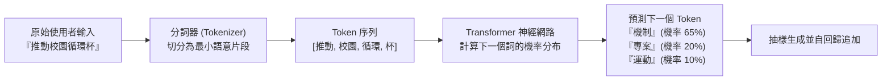
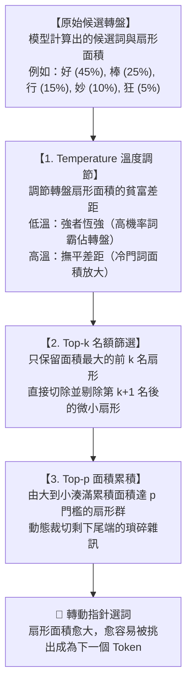
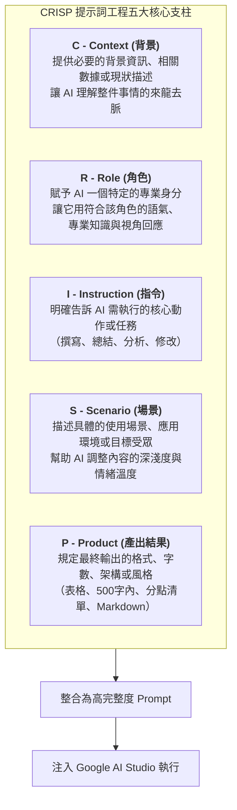
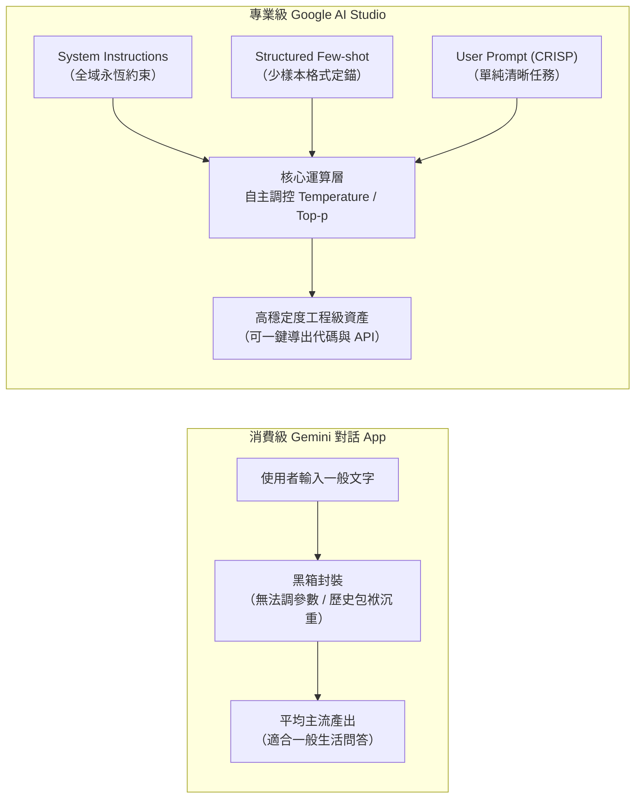
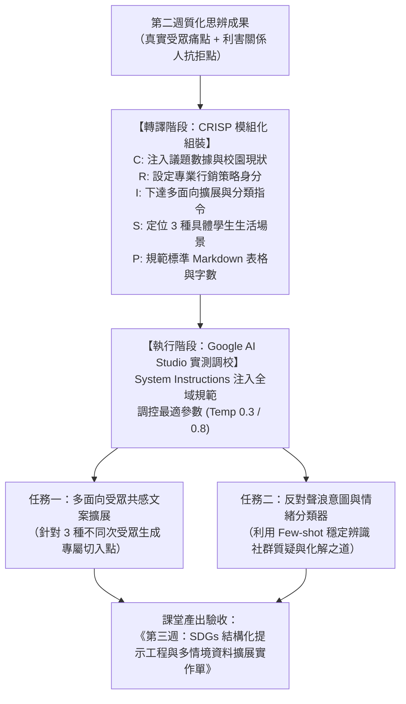

---
puppeteer:
  displayHeaderFooter: true
  headerTemplate: '<div style="font-size: 10px; margin: 0 auto;">第三章：大型語言模型生成原理與結構化提示工程實戰</div>'
  footerTemplate: '<div style="font-size: 10px; margin: 0 auto;">第 <span class="pageNumber"></span> 頁 / 共 <span class="totalPages"></span> 頁</div>'
  margin:
    top: "1.5cm"
    bottom: "1.5cm"
    left: "1.5cm"
    right: "1.5cm"
---
<style>
  /* 全域字型、字級與行距 */
  body {
    font-size: 16pt !important;
    line-height: 1.7 !important;
    font-family: "Microsoft JhengHei", "PingFang TC", "Helvetica Neue", sans-serif;
  }

  /* 階層標題微調 */
  h1 { font-size: 28pt !important; margin-bottom: 0.5em !important; }
  h2 { font-size: 22pt !important; page-break-before: always; }
  h3 { font-size: 18pt !important; }
  h4 { font-size: 15pt !important; }

  /* 表格文字與排版優化 (防 PDF 溢出) */
  table {
    width: 100% !important;
    max-width: 100% !important;
    table-layout: fixed !important;
    border-collapse: collapse !important;
    box-sizing: border-box !important;
    margin: 1.2em 0 !important;
    page-break-inside: auto !important;
  }

  thead {
    display: table-header-group !important;
  }

  tr {
    page-break-inside: avoid !important;
  }

  th, td {
    font-size: 11pt !important;
    line-height: 1.45 !important;
    padding: 6px 8px !important;
    border: 1px solid #d0d7de !important;
    vertical-align: top !important;
    word-wrap: break-word !important;
    word-break: break-word !important;
    overflow-wrap: anywhere !important;
    white-space: normal !important;
  }

  th {
    background-color: #f6f8fa !important;
    font-weight: bold !important;
    text-align: left !important;
  }

  /* 智慧欄寬配比 */
  /* 2 欄表格 (例如：實作單) */
  table tr > th:first-child:nth-last-child(2),
  table tr > td:first-child:nth-last-child(2) {
    width: 28% !important;
  }
  table tr > th:nth-child(2):nth-last-child(1),
  table tr > td:nth-child(2):nth-last-child(1) {
    width: 72% !important;
  }

  /* 3 欄表格 */
  table tr > th:first-child:nth-last-child(3),
  table tr > td:first-child:nth-last-child(3) {
    width: 22% !important;
  }
  table tr > th:nth-child(2):nth-last-child(2),
  table tr > td:nth-child(2):nth-last-child(2) {
    width: 28% !important;
  }
  table tr > th:nth-child(3):nth-last-child(1),
  table tr > td:nth-child(3):nth-last-child(1) {
    width: 50% !important;
  }

  /* 4 欄表格 */
  table tr > th:first-child:nth-last-child(4),
  table tr > td:first-child:nth-last-child(4) {
    width: 18% !important;
  }
  table tr > th:nth-child(2):nth-last-child(3),
  table tr > td:nth-child(2):nth-last-child(3) {
    width: 22% !important;
  }
  table tr > th:nth-child(3):nth-last-child(2),
  table tr > td:nth-child(3):nth-last-child(2) {
    width: 32% !important;
  }
  table tr > th:nth-child(4):nth-last-child(1),
  table tr > td:nth-child(4):nth-last-child(1) {
    width: 28% !important;
  }

  /* 5 欄表格 (例如：模型參數推薦表) */
  table tr > th:first-child:nth-last-child(5),
  table tr > td:first-child:nth-last-child(5) {
    width: 22% !important;
  }
  table tr > th:nth-child(2):nth-last-child(4),
  table tr > td:nth-child(2):nth-last-child(4) {
    width: 18% !important;
  }
  table tr > th:nth-child(3):nth-last-child(3),
  table tr > td:nth-child(3):nth-last-child(3) {
    width: 14% !important;
  }
  table tr > th:nth-child(4):nth-last-child(2),
  table tr > td:nth-child(4):nth-last-child(2) {
    width: 14% !important;
  }
  table tr > th:nth-child(5):nth-last-child(1),
  table tr > td:nth-child(5):nth-last-child(1) {
    width: 32% !important;
  }

  /* 程式碼區塊 */
  pre, code {
    font-size: 14pt !important;
    font-family: Consolas, "Courier New", monospace !important;
  }

  /* Mermaid 流程圖節點字體放大 */
  .mermaid text {
    font-size: 16px !important;
  }
</style>
---

# 第三章：大型語言模型生成原理與結構化提示工程實戰

## 課程導讀

在前面兩週的探索中，同學們不僅確立了小組專屬的聯合國永續發展目標（SDGs）專案方向，更透過 Google 的旗艦模型 Gemini 展開了一場高強度的「蘇格拉底式提問思辨」。各組在反詰與辯證中，層層剝開了原本模糊且空泛的道德主張，找出了目標受眾（Target Audience，TA）在日常生活中真實遭遇的心理痛點，以及各方利害關係人可能提出的尖銳質疑。

然而，停留在思辨階段的洞察，充其量只是零散的靈感火花。一位成熟的數位內容設計師，必須具備將「質化洞察」轉譯為「精準數位資產」的工程化能力。在過去，許多人將提示詞（Prompt）視為某種憑運氣與靈感的「通靈咒語」，以為只要隨意向 AI 拋出一句粗淺的請求，就能自動獲得驚豔的行銷文案。這種缺乏結構的溝通方式，往往導致模型產出充斥著陳腔濫調、規格失控或是天馬行空的幻覺。

本章將帶領大家告別休閒式對話，正式跨入專業級開發環境—— **Google AI Studio**。我們將深入拆解大型語言模型（Large Language Models，LLM）在文字生成時的統計本質，親手調校掌控模型發散與收斂的關鍵解碼參數，並學習業界標準的 **CRISP 結構化提示詞架構**。透過這套工程化思維，同學們將能指揮 AI 針對專案痛點，穩定生成多面向的共感文案，並建構出能精準解析社群質疑的意圖分類器。

貫穿本週學習的核心心法如下：

> **提示工程不是玄學咒語，而是嚴謹的語意介面規格設計。未來的數位內容創意總監，不靠碰運氣撞出好文案，而是透過結構化提示詞架構與解碼參數的精準調校，將龐大混沌的語言機率空間，收斂為高品質、可預期且具備高商業價值的創意產出。**

本週課堂依舊嚴格遵循 1 小時 50 分鐘的標準三段式結構：
1. **第一階段（25 分鐘）：** 大型語言模型生成原理講授、解碼參數解密與 CRISP 架構建立。
2. **第二階段（25 分鐘）：** Google AI Studio 介面解析、參數實測與 Few-shot 提示詞調校示範。
3. **第三階段（60 分鐘）：** PBL 小組實作——SDGs 結構化提示工程與多情境資料擴展工作坊。

---

## 第一節：大型語言模型生成原理與解碼參數解密

### 1.1 語言模型本質：機率接龍機器與 Token 拆解

在進入工具操作前，非資訊背景的同學首先必須建立一個關鍵認知：大型語言模型並不像人類大腦那樣，先在腦海中形成完整思想再行發言；在數學本質上，它是一個極其精密、基於龐大數據訓練而成的 **自迴歸（Autoregressive）文字接龍機器**。

當你輸入一段文字時，模型做的事情不是「理解深奧的哲學」，而是計算在當前的語境（Context）之下，下一個出現的詞彙機率分布為何。模型會從這個機率分布中抽樣選出一個詞，再將這個新詞加回原本的句子中，作為下一次預測的依據，如此循環往復，直到產生特定的結束標記為止。

在語言模型的世界裡，最小的計算單位並非英文字母或中文字元，而是 **Token（詞元）**。如下圖所示，模型在處理文本時，首先需要透過分詞器（Tokenizer）將人類語言切碎為 Token 編號：



從上圖可以發現，Token 的切分方式直接影響了模型的理解效率與記憶容量。一般而言：
- 在英文語境中，1 個 Token 大約等於 3 至 4 個英文字母，常見的英文單字（如 `sustainable`）通常為 1 到 2 個 Token。
- 在繁體中文語境中，由於模型詞表的歷史分布，許多中文字可能被拆分成 1 至 3 個 Token。這也是為什麼在同樣的文字長度下，中文通常會比英文消耗更多的運算額度與上下文視窗空間。

模型一次能夠同時閱讀與記憶的 Token 總量上限，被稱為 **上下文視窗（Context Window）**。現代旗艦模型（例如 Google Gemini 1.5 Pro）已經具備突破百萬級別（1 Million+ Tokens）的超長上下文視窗，這意味著我們能夠將整本政府永續白皮書、數萬則社群留言或數萬行網頁程式碼一次性注入模型，而不會面臨「前讀後忘」的記憶遺失問題。

### 1.2 解碼控制：Temperature、Top-p 與 Top-k 原理

既然語言模型本質上是在計算「下一個 Token 的機率分布」，那麼當機率分布被計算出來後，電腦究竟該如何決定挑選哪一個詞？這就涉及到模型的 **解碼策略（Decoding Strategies）**。

> 🎡 **核心心智模型：AI 解碼就像「轉動機率幸運轉盤」**
>
> 對非數理科系的同學來說，理解解碼最直覺的方式，就是把大型語言模型想像成一個**「機率幸運轉盤」**：
> 1. **扇形面積代表機率**：模型會為所有可能接續的字詞（Token）在轉盤上分配一塊扇形區塊。**某個 Token 所占的面積愈大，代表它的機率愈高，轉盤指針停在它上面的機會就愈大，愈容易被挑選出來**。
> 2. **解碼就是轉動指針**：指針轉到哪一個扇形，AI 就選出並輸出哪一個字。
>
> 在 Google AI Studio 等專業開發環境中，我們並非只能被動等待指針旋轉，而是能透過三個關鍵參數**「改裝這台幸運轉盤」**：
> - **Temperature**：調節轉盤上各區塊的**「貧富差距」**（扇形面積要懸殊還是平均）。
> - **Top-k**：轉盤的**「名額篩選刀」**（強制只留面積最大的前 $k$ 個扇形）。
> - **Top-p**：轉盤的**「累積面積門檻」**（從最大扇形開始依序裝盤，湊滿 $p$ % 面積就收工）。



#### 1. Temperature（溫度 / 隨機性）—— 轉盤的「貧富差距調節鈕」
- **轉盤運作邏輯**：Temperature 專門用來控制幸運轉盤上各個 Token 的**「面積差距大小」**：
  - **低溫（如 `0.1` – `0.3`，冷靜保守模式）**：極度拉大貧富差距（強者恆強）。原本機率最高的第一名詞彙，面積會被無限放大（甚至佔據轉盤 99% 以上），其他次要詞彙幾乎沒有被抽中的機會。此時模型表現得極度確定、守秩序且可預測，連續問幾次答案幾乎完全相同。
  - **高溫（如 `0.7` – `1.0`，發散創意模式）**：撫平各扇形差距（人人有機會）。原本只有微小面積的次要詞彙，扇形被成倍拉寬；第一名常見詞的壟斷優勢被削弱。次要但富有新意、跨領域的用詞更有機會被抽中，產出充滿驚喜與想像力；但若溫度過高（如超過 `1.8`），連文法不通的生僻怪字面積也變大，導致語法解體與胡言亂語。
  *(技術小補充：在底層演算法中，這個負責把分數轉換成機率轉盤的數學工具叫做 **Softmax**，而溫度值就是公式中的平滑除數。對非數理同學來說，只要理解成「調控轉盤貧富差距的拉桿」即可！)*
- **行銷應用**：若要進行精確的社群情緒分類、提取客觀數據或輸出嚴格的 JSON 格式，應將溫度設低（`0.0` – `0.3`）；若要腦力激盪廣告 Slogan、撰寫社群生活化文案或發想新穎的故事隱喻，應將溫度設高（`0.7` – `1.0`）。

#### 2. Top-k —— 轉盤的「名次篩選刀（只留前 k 大扇形）」
- **轉盤運作邏輯**：轉盤上原本可能擠滿了成千上萬個極度冷門、奇奇怪怪的候選詞（包含錯字、生僻符號或不合語法的字）。Top-k 就像一把利刀，**強制規定轉盤上「只准保留面積排名前 $k$ 名的扇形」（例如 $k=40$），直接砍掉並剔除第 41 名之後的所有微小扇形**，再將剩下的前 $k$ 個扇形依比例重新拼滿 100% 的轉盤。
- **行銷應用**：Top-k 是非常穩健的「安全防護網」。例如設定 $k=40$，能確保模型永遠只在最靠前、最正常的 40 個常規字詞中挑選，徹底過濾掉排名數萬名以外的生僻亂碼或怪異符號，防止模型「走火入魔」。

#### 3. Top-p（核取樣 Nucleus Sampling）—— 轉盤的「累積面積門檻（湊滿 p% 就收工）」
- **轉盤運作邏輯**：與 Top-k「死板固定挑前幾名」不同，Top-p 看的是**「轉盤上候選詞的累積總面積」**。系統會先把所有扇形由大到小排序，並從最大的開始依序放上轉盤，**一旦放進去的所有扇形面積加總達到設定的門檻值 $p$（例如 `0.9` 即 90%），就立刻關閉大門，將剩下 10% 的尾端瑣碎小扇形全部切掉扔掉**。
  - **語境非常確定時**：例如輸入「白日依山...」，接續的「盡」可能自己就佔了 95% 的面積，轉盤瞬間只剩下 1 個扇形，指針 100% 命中「盡」，絕不亂猜；
  - **語境非常開放時**：例如輸入「這道料理的味道非常...」，前幾名可能都只有 5%~10% 的面積，系統會自動納入 20~30 個形容詞直到湊滿 90%，轉盤自動擴大，提供豐富多元的選擇。
  因此，Top-p 是一張**「能夠根據語境確定度、動態伸縮候選名單」**的高智慧轉盤！
- **行銷應用**：Top-p 能在「語意合理通順」與「遣詞用字多樣」之間取得最佳平衡。在社群文案與內容生成中，通常建議設為 `0.9` – `0.95`，既能保證文意不會荒腔走板，又能給予文案足夠的辭彙靈活性。

為了讓大家在專案實作時能迅速找到最合適的參數組合，下表整理了不同數位行銷任務的推薦配置：

| 專案應用任務場景 | 推薦模型 | 建議 Temperature | 建議 Top-p | 核心目標與控制重點 |
| :--- | :--- | :--- | :--- | :--- |
| **數據提取與事實分類**（如社群留言情緒標記、官方報告提取關鍵數字） | Gemini 1.5 Flash | **0.0 – 0.2** | **0.8** | 追求極致的邏輯穩定與格式精準，杜絕任何胡思亂想。 |
| **結構化程式與排版生成**（如活動網頁 HTML/CSS 代碼協作、Markdown 表格） | Gemini 1.5 Pro | **0.2 – 0.4** | **0.9** | 確保標籤語法嚴格閉合，避免代碼出現低級語法錯誤。 |
| **受眾共感文案與多情境改寫**（如針對外宿生、小資族撰寫不同角度的 IG 貼文） | Gemini 1.5 Pro | **0.7 – 0.85** | **0.95** | 兼顧邏輯主線與遣詞用字的生活化彈性，激發共鳴。 |
| **前衛創意發想與隱喻生成**（如專案主視覺概念激盪、科幻永續短片世界觀） | Gemini 1.5 Pro | **0.9 – 1.2** | **0.98** | 打破常規思維壁壘，尋找非典型跨領域意象碰撞。 |

### 1.3 結構化提示工程架構：CRISP 結構化框架

了解了模型挑選詞彙的底層機制後，我們便能理解： **提示詞的本質，就是為模型建構出一個高度清晰、能夠引導機率分布收斂在我們期望區間的語意邊界**。

許多初學者的提示詞往往只有一句話（例如「幫我寫減塑貼文」），這等於任由模型在數十億個機率分支中隨意漫遊。為了讓非資訊背景的同學也能寫出如資深工程師般穩定的提示詞，本課程導入業界與學術界廣泛採用的 **CRISP 結構化提示詞架構**：



這五個維度如同建構一座穩固建築的地基與梁柱，缺一不可：

1. **C - Context (背景) **：提供必要的背景資訊、相關數據或現狀描述，讓 AI 理解整件事情的來龍去脈。
   - *反面案例*：「我們要推廣循環杯。」（太過單薄，AI 不知前因後果）
   - *CRISP 示範*：「在台灣某大學校園中，學生每日外帶手搖飲產生超過 2,000 個單次性塑膠杯。雖然校方設置了租借站，但外宿生常反映清洗麻煩與借還點不足，導致使用率僅有 5%。」
2. **R - Role (角色) **：賦予 AI 一個特定的專業身分（例如：行銷專家、資深工程師、心理諮商師），讓它能用符合該角色的語氣、專業知識和視角來回應。
   - *CRISP 示範*：「你是一位專精於『青年社群行為轉變』的永續行銷總監，擅長運用行為經濟學的輕推理論（Nudge Theory），以幽默且具備同理心的語言引導大專學生改變消費習慣。」
3. **I - Instruction (指令) **：明確告訴 AI 需要執行什麼任務或動作（例如：撰寫、總結、分析、修改），這是提示詞的核心。
   - *CRISP 示範*：「請針對上述痛點，設計一套三階段的社群挑戰賽企劃大綱，並撰寫一則具有強烈點擊渴望的活動預告文案。」
4. **S - Scenario (場景) **：描述具體的使用場景、應用環境或目標受眾（例如：用於 LinkedIn 的商務貼文、給國小學生的科普文章），幫助 AI 調整內容的深淺度。
   - *CRISP 示範*：「這篇文案將發布於 Instagram 官方帳號的圖卡輪播首頁，閱讀受眾為 18 至 22 歲、注重穿搭與生活風格、厭惡生硬道德說教的大學外宿族群。」
5. **P - Product (產出結果) **：規定最終輸出的格式、字數、架構或風格（例如：表格、500字內、分點清單、Markdown 格式）。
   - *CRISP 示範*：「輸出格式請使用標準 Markdown 表格，欄位需包含【貼文標題 (15字內)】、【內文核心亮點 (80字內)】、【引導留言之 CTA】與【推薦 3 個社群 Hashtags】。」

### 1.4 課堂探索小活動：直覺測試——Temperature 調高會發生什麼事？

請同學們花費 3 分鐘，在組內思考以下情境並討論：
1. 如果你正在編寫一組程式碼，用來自動計算小組專案的碳足跡公式，你應該將 Temperature 設為 `0.0` 還是 `1.0`？為什麼？
2. 如果將 Temperature 設為 `0.0`，在完全不改變 Prompt 的前提下連續按下 3 次生成，模型給出的答案文字會完全相同嗎？
3. 如果將 Temperature 拉高至最大極限值（例如 `2.0`），你預期模型產出的內容會出現什麼樣的現象？

> **老師的提醒：**
> * **避免「祈求式」與「情緒勒索式」提示詞**：很多初學者喜歡在 Prompt 結尾加上「請一定要寫得非常優秀、非常吸引人、拜託你了」等句子。請記住，大語言模型沒有虛榮心，也沒有愧疚感，它只是一套純粹的機率統計系統。「非常吸引人」是一個毫無量化標準的主觀空詞，模型根本無法從中推算出字詞的分佈權重。與其寫十句拜託，不如明確寫下 **「使用第二人稱稱呼」、「加入反問句開場」或「字數嚴格限制在 80 字以內」** 等具體的規格條件（Product）。
> * **切勿將「隨機性」等同於「高品質創意」**：把 Temperature 拉高，模型只是選取了機率較低的詞彙組合。如果提示詞本身缺乏深厚的 Context（背景）與犀利的 Instruction（指令），高溫只會製造出前言不對後語的胡言亂語，絕不會自動誕生天才般的創意。

---

## 第二節：Google AI Studio 專業開發實戰

### 2.1 消費級對話視窗 vs. 專業開發環境（Google AI Studio）

在日常生活中，絕大多數同學所接觸的 AI 介面是如 ChatGPT 或 Gemini App 般的「消費級對話視窗」。這類產品是為了滿足一般大眾的日常聊天與簡易問答而設計的，其底層封裝了大量的預設系統指令，並自動維護了整個會話歷史。

然而，在專業的數位內容設計與工作流建置中，消費級介面存在三大難以克服的致命傷：
1. **參數完全黑箱**：在對話 App 中，使用者無法自主調節 Temperature 或 Top-p，只能接受官方預設的折衷數值，難以滿足特定任務的極端需求。
2. **上下文污染（Context Pollution）**：當你在同一個對話視窗聊了幾十輪之後，先前的廢話、測試用詞與模型的錯誤回答都會殘留在記憶中，導致模型後續產出的專注度嚴重下降，甚至被早期的錯誤引導偏離主題。
3. **無全域角色鎖定**：一般對話框中輸入的設定，往往在聊了十幾輪後就被模型「忘記」，出現角色人格飄移的現象。

為此，我們必須導入專業級模型工作台—— **Google AI Studio**（[aistudio.google.com](https://aistudio.google.com)）。



如上圖所示，Google AI Studio 提供了三大核心優勢：
- **全透明參數滑桿**：可在右側面板隨意切換模型（如 Gemini 1.5 Pro 與 Gemini 1.5 Flash），並即時滑動調控 Temperature、Top-p 與 Safety Settings（安全審查閾值）。
- **獨立的 System Instructions 區塊**：賦予全域永恆的規則約束，不受對話長度影響。
- **支援少樣本（Few-shot）示範結構**：以輸入-輸出對照的形式直接鎖定輸出排版。

### 2.2 System Instructions 的全域約束力量

在 Google AI Studio 中，最顯眼的特色之一就是位於主畫面最上方的 **System Instructions（系統指令區）**。

在大型語言模型的運作機制中，System Instructions 具有高於一般使用者對話的權限權重。它相當於在模型進行任何推論之前，預先在其大腦的最高層級寫下一套「絕對行為守則」。

在落實 CRISP 架構時，我們通常會將 **R (Role)** 與 **C (Context)** 的基礎定義置入 System Instructions 中。例如：

```text
【System Instructions 設定範例】
你是一位專注於聯合國 SDG 12（責任消費與生產）的數位內容策略顧問。
你的唯一職責是協助青年團隊將複雜的永續議題轉化為具備高社群感染力的內容。
在所有後續回應中，你必須嚴格遵守以下守則：
1. 嚴禁使用居高臨下的道德說教口吻（如「大家必須愛護地球，否則會遭到報應」）。
2. 一律採用生活化微觀視角，將環境成本與大專學生的日常生活（外送、網購、外宿料理）直接連結。
3. 所有產出均以繁體中文（台灣習慣用語）呈現，禁止使用簡體中文或中國大陸慣用行銷術語。

```

一旦在 System Instructions 中確立了上述守則，後續無論你在下方的對話區提出多麼隨意的問題，模型都會自動套用這些過濾器與語言風格，徹底根除了「聊著聊著就破功變回客服機器人」的通病。

### 2.3 Few-shot Prompting：用少樣本示範杜絕模型脫軌

在提示工程學中，引導模型的方式主要可分為兩大流派：
1. **Zero-shot Prompting（零樣本提示）**：只給予文字規則，完全不提供任何示範案例，全憑模型自身的預訓練常識進行推理。
2. **Few-shot Prompting（少樣本提示）**：除了文字規則外，明確提供 1 到 3 個高品質的「輸入範例 ➔ 正確輸出」對照組。

實務經驗告訴我們，大語言模型是極其強大的「模式模仿器（Pattern Matcher）」。很多時候，你用一千字詳細解釋表格欄位應該如何排版，模型的遵從率可能只有 80%；但如果你直接給出 2 個精準的範例示範，模型的輸出正確率往往能瞬間躍升至 99% 以上。

以下是在 Google AI Studio 中建構一個「SDGs 社群留言情緒與意圖分類器」的 Few-shot 設定範例：

```markdown
【Few-shot 示範結構】

使用者輸入範例一：
「循環杯洗得乾淨嗎？之前在超商借過一次裡面還有口紅印，超級噁心，打死都不會再用第二次！」
模型期望輸出：
| 留言核心意圖 | 衛生與清潔信任疑慮 |
| 情緒極性類別 | 極度負面 (Strongly Negative) |
| 受眾心理痛點 | 害怕傳染病菌、對公共清洗流程缺乏透明信任度 |
| 建議化解策略 | 拍攝『循環杯高溫殺菌清洗廠 30 秒透明化縮時影片』，主打洗淨度超越個人手洗。 |

使用者輸入範例二：
「自備環保杯折 5 元其實蠻有感的耶，一個月下來可以多喝一杯星巴克，推推！」
模型期望輸出：
| 留言核心意圖 | 經濟誘因驅動肯定 |
| 情緒極性類別 | 積極正面 (Positive) |
| 受眾心理痛點 | 追求小確幸省錢感、需要同儕行為認同 |
| 建議化解策略 | 發起『省下來的錢累積挑戰』社群打卡活動，擴大誘因傳播效應。 |

```

當模型在 System Instructions 或 Prompt 開頭看過了這兩組結構工整的示範後，當你輸入第三組真實學生的抱怨留言時，模型便能 100% 嚴格按照該表格欄位與專業分析深度進行輸出，絕不拖泥帶水。

### 2.4 課堂操作小練習：3 分鐘 AI Studio 參數極端對比實測

現在請全班同學打開瀏覽器，登入 Google AI Studio（[aistudio.google.com](https://aistudio.google.com)），進行 3 分鐘實機快測：
1. 點擊右上角「Create New Prompt」，選擇「Chat Prompt」。
2. 在右側參數欄中，將 Model 保持為 `Gemini 1.5 Pro`。
3. **第一輪測試（極度收斂）**：將 Temperature 拉至最底端的 `0.0`。在下方輸入框發送：*「請用一句話總結為什麼大學生需要重視剩食問題。」* 觀察其生成文字。點擊重新生成（Rerun），觀察兩次輸出的差異。
4. **第二輪測試（極度發散）**：將 Temperature 拉高至 `1.5`。再次輸入完全相同的指令，觀察其生成的詞彙風格、句式多樣性是否產生了戲劇性的變化。
5. 與隔壁同學交流：哪一種溫度生成的句子最適合做為海報主視覺標語？哪一種最適合做為正式報告結論？

> **老師的真心話：**
> * **好 Prompt 是改出來的，不是通靈出來的**：許多同學在第一次看到 AI 回覆不如預期時，往往立刻心灰意冷，認為「AI 根本沒有新聞說的那麼聰明」。請記住，在專業軟體工程中，程式碼需要反覆 Debug；在提示工程中也是完全一樣的道理。每一次看到不合適的產出，請立刻回頭審視 CRISP 五大構件：是不是背景（Context）給得太少？是不是限制（Product）規範得不夠具體？只要補上 1 個關鍵限制或示範，產出品質通常就會脫胎換骨。
> * **不要在同一視窗處理多個互不相干的任務**：在 AI Studio 中，當你要從「文案發想」切換到「問卷資料分析」時，請務必養成開新分頁（New Prompt）的良好衛生習慣。清空歷史負擔，才能讓模型發揮最高純度的推理能力。

---

## 第三節：PBL 課堂工作坊——SDGs 結構化提示詞與資料擴展

### 3.1 從「第二週思辨洞察」轉譯為「結構化提示詞」工作流

進入課堂最後 1 小時的小組實作。在上一週的《SDGs 議題之 Gemini 蘇格拉底思辨紀錄表》中，各組已經辨識出三大珍貴的質化素材：
1. 被蘇格拉底挑戰後所修正的 **真痛點**。
2. 反對立場利害關係人的 **真實抗拒理由**。
3. 專案在實施時可能面臨的 **執行瓶頸**。

本週的任務，就是將這些質化素材全面「工程化」，搭建起小組專屬的 CRISP 提示詞引擎，完成兩大核心行銷產出任務：



### 3.2 任務一：多面向受眾共感文案生成（擴展性任務）

在數位行銷的世界中，不存在一套能打動所有人的萬能文案。即使是同一項永續主張，面對不同價值觀的受眾，溝通切入點必須截然不同。

各組必須調用 CRISP 架構，將專案的核心倡議拆解為至少 3 種不同次受眾（Sub-segments）的傳播版本。以第一週的「醜蔬果剩食拯救專案《格外美好》」為例：
- **次受眾 A（月底省錢自炊族）**：溝通重點在於「五星級食材、產地直採半價、省下荷包」。
- **次受眾 B（熬夜外食健康焦慮族）**：溝通重點在於「外食缺乏纖維、吃進純天然抗氧化維生素、給身體無負擔的修復」。
- **次受眾 C（注重生活儀式感的料理玩家）**：溝通重點在於「每顆蔬果獨一無二的奇趣外型、餐桌上的美學故事、拍照打卡熱點」。

小組應在 AI Studio 中將 Temperature 調整至 `0.7 - 0.8` 之間，讓模型在確保核心論述不走樣的前提下，彈性調用符合各類學生日常語彙的生動文案。

### 3.3 任務二：社群反對聲浪意圖與情緒極性標記（分類任務）

永續專案在社群傳播時，必然會遭遇各方質疑與負面反彈。優秀的內容設計師必須防患未然，提前預判並建立「社群抗拒化解知識庫」。

各組需在 AI Studio 中運用 **Few-shot Prompting**，將 Temperature 調降至 `0.1 - 0.2`，輸入至少 3 則真實可能遇到的反對質疑（例如店家抱怨成本、同學嫌麻煩、質疑漂綠騙局），要求模型嚴格輸出：
1. **抗拒核心意圖**（精準診斷反對者究竟在擔心什麼）。
2. **情緒極性分類**（正面 / 建設性中立 / 強烈負面質疑）。
3. **行銷化解策略與文案應對方針**（以建設性同理心化解對立）。

### 3.4 課堂實作任務：《SDGs 結構化提示工程與多情境資料擴展實作單》

請各組利用接下來的課堂實作時間（40 分鐘），在 Google AI Studio 中共同協作，調校出最穩定的 Prompt，並完成以下規格表單填寫與提交：

| 欄位項目 | 規劃內容填寫區（小組共編） |
| :--- | :--- |
| **小組組名與專案名稱** | 組別：第 ______ 組 ｜ 專案名稱：《________________________________》 |
| **選定之 SDGs 目標** | 第 ______ 號目標：________________________（中文名稱） |
| **AI Studio 環境配置紀錄** | 所選模型：`Gemini 1.5 Pro` / `Gemini 1.5 Flash`<br/>Temperature 設定值：______ ｜ Top-p 設定值：______<br/>參數調校理由（約 30 字）： |
| **小組專屬 CRISP 提示詞架構** | **【C - Context (背景)】 **：<br/>**【R - Role (角色)】 **：<br/>**【I - Instruction (指令)】 **：<br/>**【S - Scenario (場景)】 **：<br/>**【P - Product (產出結果)】 **： |
| **任務一：多面向受眾文案擴展成果**<br/>（Markdown 表格呈現） | 1. **【次受眾 A 類型與痛點】 **：<br/>• 主標題 (Hook)：<br/>• 核心訴求內文 (約 80 字)：<br/>2. **【次受眾 B 類型與痛點】 **：<br/>• 主標題 (Hook)：<br/>• 核心訴求內文 (約 80 字)：<br/>3. **【次受眾 C 類型與痛點】 **：<br/>• 主標題 (Hook)：<br/>• 核心訴求內文 (約 80 字)： |
| **任務二：反對聲浪意圖分類測試**<br/>（Few-shot 分類成果） | **【輸入的真實反對質疑情境】 **：<br/>**【模型自動標記之情緒極性】 **：[正面 / 中立 / 強烈負面]<br/>**【模型診斷之核心抗拒原因】 **：<br/>**【公關文案化解與溝通對策】 **： |
| **本週提示工程調校心得與反思** | 請用 100 字說明：在調校 System Instructions 與 Few-shot 範例的過程中，你們發現了哪項 **最有效的調優關鍵技巧**？ |

在討論過程中，授課教師與助教將逐組巡視，針對各組的 CRISP 完整度、參數設定合理性以及輸出結果的收斂度進行即時輔導（20 分鐘）。

### 3.5 老師的課堂點評與收斂指南

在巡堂指導各組編寫 CRISP 提示詞時，老師最常抓出的三大架構毛病包括：
1. **情境（Scenario）嚴重缺席**：很多組別在 Prompt 中只寫「寫一篇 IG 貼文」，卻完全沒交代目標受眾的具體生活情境。要知道，「發給外宿自炊學生的貼文」與「發給趕著早八上課的大一新生的貼文」，兩者的語言節奏與痛點切角是天差地別的！
2. **規格（Product）流於抽象**：寫出「字數適中、語氣溫暖」這類形容詞，幾乎等於沒設限制。請務必落實量化規格——明確寫出「條列 3 點、每點不超過 50 字、文末包含 1 個反問句與 3 個標籤」。
3. **誤把分類任務當創意任務**：在進行社群反對質疑分類時，如果把 Temperature 設在 `0.9`，模型會給出五花八門的自由發揮，導致分類標準崩潰。 **記住：分類要冷靜（低溫），創作要熱情（高溫）！**

> **老師的真心話：**
> * **資料擴展不是洗版垃圾訊息，而是分眾同理心的體現**：很多傳統行銷人習慣用同一套通稿狂轟濫炸所有管道，最後只換來大眾的麻木與封鎖。今天我們學習用 AI Studio 進行資料擴展，目的不是為了製造大量廉價的文字垃圾，而是要讓我們有能力為每一群懷抱不同擔憂的真實人類，量身打造最能溫暖解惑的溝通橋樑。
> * **今天寫下的 CRISP，是未來 13 週的靈魂模組**：今天在 AI Studio 經過千錘百煉調校出來的專案 Background 與 Role，在第 4 週將直接轉化為 Imagen 3 的海報氛圍設定，在第 10 週將直接成為 Gemini Canvas 生成活動網頁前端代碼時的設計規範。基礎打得越扎實，後面的多模態爆發力就越驚人！

---

## 本章小結與課後任務

### 核心觀念回顧

1. **語言模型的統計本質：** 大型語言模型是在高維語意空間中進行「自回歸 Token 機率預測」的運算系統，上下文視窗決定了模型同時處理長資訊的廣度。
2. **解碼控制的核心價值：** Temperature 決定了思維是精確收斂還是發散冒險；Top-p 與 Top-k 則建立了動態的合理詞彙安全網。
3. **CRISP 結構化提示詞架構：** 牢牢掌握 Context（背景）、Role（角色）、Instruction（指令）、Scenario（場景）、Product（產出結果）五大模組，徹底告別隨機通靈的提示詞寫法。
4. **Google AI Studio 的工程級威力：** 善用 System Instructions 鎖定全域守則，運用 Few-shot Prompting 錨定輸出格式，實現高重複性與高穩定度的專案資料資產沉澱。

---

### 本週產出與課後檢核清單（Checklist）

請各組 PM 與組員在下課前務必完成以下檢核：

- [ ] **完成 AI Studio 開發環境註冊與登入**：全組成員均能正常操作 Google AI Studio 主介面。
- [ ] **完成參數極端實測**：親身體會過 Temperature 0.0 與 1.5 在生成文字上的本質差異。
- [ ] **完成小組 CRISP 提示詞架構建立**：完整填寫 Context、Role、Instruction、Scenario、Product 五大要素。
- [ ] **完成多面向受眾文案擴展**：生成至少 3 組針對不同學生群體的差異化行銷文案。
- [ ] **完成反對聲浪意圖分類器測試**：運用 Few-shot 結構穩定標記社群質疑與化解策略。
- [ ] **繳交實作成果單**：將《第三週：SDGs 結構化提示工程與多情境資料擴展實作單》上傳至課程協作雲端，並獲授課教師查核確認。

---

### 下週預告

在下一週（第 4 週，10/7）的課程中，我們將正式跨出純文字領域，迎來視覺感官的震撼升級—— **【多模態生成工具實作：提示和圖像屬性指南】 **！
我們將導入 Google 最新的頂級影像生成模型 **Imagen 3**。同學們將把本週所學到的結構化提示工程思維，延伸至光影、鏡頭視角、景深、膠卷質感與物理材質的視覺語彙中，親手為小組專案渲染出第一張直擊人心的核心主視覺海報！請大家帶著審美的好奇心，我們下週見！
